<!-- ========================= BANNER ========================= -->

  

<!-- ========================= INTRO ========================= -->

<h1 align="center">Hi 👋, I'm Saif Rohyal</h1>

  

  

---

# 👨‍💻 About Me

- 📊 Passionate Data Analyst focused on turning raw data into meaningful insights.
- 🐍 Working with Python, SQL, Excel, and Power BI.
- 📈 Interested in Business Intelligence, Data Analytics, and Machine Learning.
- 🌱 Currently learning Statistics, Machine Learning, and Deep Learning.
- 💼 Building real-world portfolio projects.
- 🎯 Goal: Become a Professional Data Scientist.

---

# 🛠️ Tech Stack

### 💻 Programming & Databases

### 📊 Data Analytics & Machine Learning

### ⚙️ Development Tools

---

# 📂 Featured Projects

- 📊 Sales Dashboard (Power BI)
- 📈 Retail Sales Analysis (SQL)
- 👨‍💼 HR Analytics Dashboard
- 💰 Financial Performance Dashboard
- ❤️ Customer Churn Analysis
- 🐍 Python Data Analysis
- 📊 Excel Dashboard
- 🗄 SQL Business Case Studies

---

# 🌱 Currently Learning

- 📘 Statistics
- 🤖 Machine Learning
- 🧠 Deep Learning
- 📚 Scikit-Learn
- 🔥 TensorFlow

---

# 🔥 GitHub Streak

---

# 📈 Contribution Graph

---

# 📫 Connect With Me

&nbsp;

&nbsp;

&nbsp;

---

# 💡 Quote

> **-"Information is the oil of the 21st century, and analytics is the combustion engine."** 
> **—— Peter Sondergaard**

---

⭐ **Thanks for visiting my profile!** ⭐

