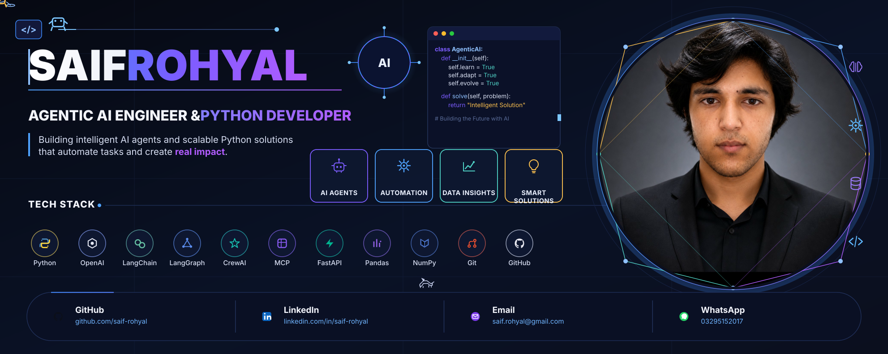

<!-- ========================= BANNER ========================= -->

  

<!-- ========================= INTRO ========================= -->

  

  

---

## 👨‍💻 About Me

- 🤖 Building intelligent AI agents, automation workflows, and production-ready applications.
- 🐍 Python Developer with a passion for clean architecture and scalable software.
- ⚡ Experienced in developing AI-powered solutions using modern frameworks and tools.
- 💡 Passionate about open-source technologies, automation, and solving real-world problems with AI.
- 📚 Dedicated to continuous learning through hands-on projects and practical experimentation.
- 🎯 Mission: To become a world-class Agentic AI Engineer creating innovative and impactful AI systems.
---

### 🛠️ Tech Stack

 

 

## 📂 Featured Projects

- 📊 [Sales Data Analysis (SQL)](https://github.com/saif-rohyal/Sales-Data-Analysis-SQL)
- ❤️ [SQL Ecommerce Customer Churn Analysis](https://github.com/saif-rohyal/SQL-Ecommerce-Customer-Churn-Analysis)
- 👨‍💼 HR Analytics Dashboard
- 💰 Financial Performance Dashboard
- 🐍 Python Data Analysis
- 📊 Excel Dashboard
- 🗄 SQL Business Case Studies

---

## 🌱 Currently Learning

- 📘 Statistics
- 🤖 Machine Learning
- 🧠 Deep Learning
- 📚 Scikit-Learn
- 🔥 TensorFlow

---

## 🔥 GitHub Streak

---

## ☕ Buy Me a Coffee

---

## 📫 Connect With Me

&nbsp;

&nbsp;

&nbsp;

---

## 💡 Quote

> **-"Information is the oil of the 21st century, and analytics is the combustion engine."**
> **—— Peter Sondergaard**

---

⭐ **Thanks for visiting my profile!** ⭐

