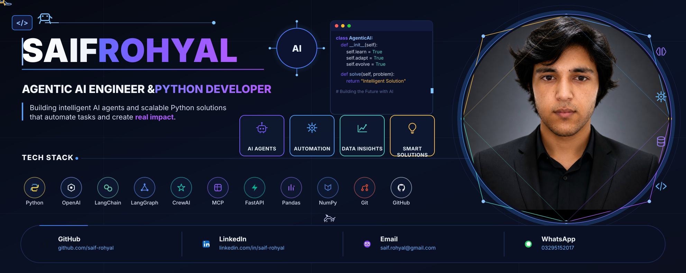

<!-- ========================= BANNER ========================= -->

<p align="center">
  
</p>

<p align="center">
  <a href="https://git.io/typing-svg">
    
  </a>
</p>

<p align="center">
  
</p>

<p align="center">
<a href="https://github.com/saif-rohyal?tab=followers">

</a>
<a href="https://github.com/saif-rohyal?tab=repositories">

</a>
</p>

---

# 👨‍💻 About Me

### Full-Stack Agentic AI Engineer

I build AI agents, LLM applications, and automation systems that connect intelligent models with tools, APIs, databases, and real-world workflows.

My main focus is **Agentic AI** — building systems that can understand a goal, reason about tasks, use tools, take actions, maintain context, and complete multi-step workflows.

I work mainly with **Python, FastAPI, LangChain, LangGraph, MCP, n8n, SQL, PostgreSQL, Redis, Docker, and modern LLM platforms**.

I enjoy taking an idea, understanding the problem behind it, and turning it into something useful and practical.

---

# 🧠 Agentic AI Engineering

<p align="center">

```text
                  ┌──────────────────────┐
                  │      USER GOAL       │
                  └──────────┬───────────┘
                             │
                             ▼
                  ┌──────────────────────┐
                  │       AI AGENT       │
                  └──────────┬───────────┘
                             │
              ┌──────────────┼──────────────┐
              │              │              │
              ▼              ▼              ▼
          Reasoning        Memory          Tools
              │              │              │
              ▼              ▼              ▼
            LLMs         Databases       MCP / APIs
              │              │              │
              └──────────────┼──────────────┘
                             │
                             ▼
                  ┌──────────────────────┐
                  │   REAL-WORLD ACTION  │
                  └──────────────────────┘
```

</p>
---

# 🛠️ Tech Stack

## 🐍 Languages & Backend

<p align="center">


</p>

## 🤖 Agentic AI & LLMs

<p align="center">


</p>

## ⚡ Automation & Integrations

<p align="center">


</p>

## 🗄️ Databases

<p align="center">


</p>

## ☁️ DevOps & Development

<p align="center">


</p>

## 📊 Data & Machine Learning

<p align="center">


</p>

---

# 📂 Featured Projects

| 🚀 Project | 📝 Description | 🛠️ Tech Stack |
|------------|----------------|----------------|
| 🤖 **[AgentOS — Autonomous AI Task Orchestrator](https://github.com/saif-rohyal)** | AI agent that plans tasks, selects tools, executes multi-step workflows, maintains state, and verifies results. | Python • LangGraph • LangChain • MCP • FastAPI |
| 🧠 **[AI Support Engineer — RAG Support Agent](https://github.com/saif-rohyal)** | Intelligent customer-support agent with RAG, memory, tool calling, knowledge retrieval, and human escalation. | Python • FastAPI • LangChain • RAG • PostgreSQL |
| ⚡ **[n8n AI Automation Hub](https://github.com/saif-rohyal)** | AI-powered business automation connecting LLMs with APIs, databases, webhooks, email, and external services. | n8n • OpenAI • Python • APIs • PostgreSQL |
| 🔌 **[MCP Tool Server](https://github.com/saif-rohyal)** | Custom MCP server that gives AI agents access to APIs, databases, external tools, and structured actions. | Python • MCP • FastAPI • LangGraph |
| 🔎 **[Autonomous AI Research Team](https://github.com/saif-rohyal)** | Multi-agent research system where specialized agents collect, analyze, verify, and generate structured reports. | Python • LangGraph • LangChain • RAG • FastAPI |
| 📊 **[Sales Data Analysis (SQL)](https://github.com/saif-rohyal/Sales-Data-Analysis-SQL)** | SQL-based sales analysis and KPI reporting. | SQL • MySQL • Data Analysis |
| ❤️ **[E-commerce Customer Churn Analysis](https://github.com/saif-rohyal/SQL-Ecommerce-Customer-Churn-Analysis)** | Customer churn and retention analysis using SQL. | SQL • Data Analysis |

---

# 💡 AI Engineering Capabilities

| 🤖 Agentic AI | 🧠 LLM Engineering | ⚡ Automation |
|:---:|:---:|:---:|
| AI Agents | LLM Applications | n8n |
| LangGraph | RAG Systems | API Automation |
| LangChain | Prompt Engineering | Webhooks |
| MCP | Tool Calling | Business Workflows |
| Multi-Agent Systems | Vector Search | AI Integrations |

---


### Engineering Principles

<p align="center">

**Clean Code • Modular Architecture • Scalability • Testing • Automation • Practical Solutions**

</p>

---

# 📈 What I'm Exploring

<p align="center">

🤖 Agentic AI  
+
🧩 Multi-Agent Systems  
+
🔌 MCP  
+
📚 RAG  
+
⚡ AI Automation  
+
🧠 LLM Applications  
+
🐍 Backend Engineering

</p>

---

# 📊 GitHub Analytics

<p align="center">


---

# 🌐 Let's Connect

<p align="center">

<a href="https://github.com/saif-rohyal">

</a>

<a href="https://www.linkedin.com/in/saif-rohyal">

</a>

<a href="YOUR_FIVERR_LINK">

</a>

<a href="YOUR_UPWORK_LINK">

</a>

<a href="mailto:saif.rohyal@gmail.com">

</a>

<a href="https://www.kaggle.com/saifrohyal">

</a>

</p>

<p align="center">

📧 <b>Email:</b> saif.rohyal@gmail.com  
<br>
💼 <b>LinkedIn:</b> linkedin.com/in/saif-rohyal  
<br>
🐙 <b>GitHub:</b> github.com/saif-rohyal

</p>

---

<div align="center">

# 🚀 Building Intelligent Systems That Do Real Work

### Agentic AI • LLMs • MCP • Automation • Python • Backend Engineering

<br>

**Learn. Build. Automate. Improve.**

<br>

⭐ **Explore my repositories and follow my journey.**

<br><br>

### Thanks for visiting!

</div>
