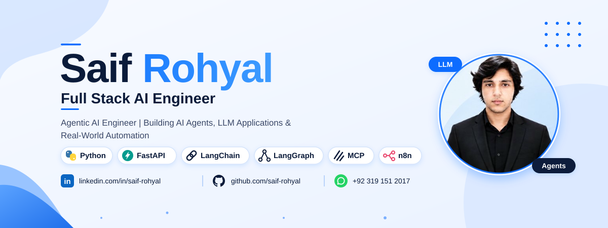

  

  

 

  

# 👨‍💻 About Me

### Full-Stack Agentic AI Engineer

I build AI agents, LLM applications, and automation systems that connect intelligent models with tools, APIs, databases, and real-world workflows.

My main focus is **Agentic AI**  building systems that can understand a goal, reason about tasks, use tools, take actions, maintain context, and complete multi-step workflows.

I work mainly with **Python, FastAPI, LangChain, LangGraph, MCP, n8n, SQL, PostgreSQL, Redis, Docker, and modern LLM platforms**.

I enjoy taking an idea, understanding the problem behind it, and turning it into something useful and practical.

# 🧠 AI Engineering Stack

  

  
### AGENTIC AI

### LLM ENGINEERING

### BACKEND & AUTOMATION

### DATA & INFRASTRUCTURE

# 🚀 Featured AI Systems

<table>
<tr>
<td width="50%">

  
### 🤖 Multi-Tier AI Support

AI customer-support system with intelligent routing, RAG, memory, escalation, and human handoff.

**Core:**  
`Python` `LangGraph` `LangChain` `RAG` `FastAPI`

</td>

<td width="50%">

  
### 🎯 Autonomous Job & Lead Agent

Discovers opportunities, matches criteria, generates personalized outreach, and sends candidates for human review.

**Core:**  
`Python` `LLMs` `Automation` `n8n` `APIs`

</td>
</tr>

<tr>
<td width="50%">
  

### 💰 Price & Inventory Agent

Monitors competitor prices and inventory, generates pricing recommendations, and requests approval before execution.

**Core:**  
`Python` `LLMs` `PostgreSQL` `Slack` `Telegram`

</td>

<td width="50%">
  

### 📞 Voice Booking Assistant

Conversational voice agent that handles calls, checks availability, and books appointments automatically.

**Core:**  
`Python` `STT` `LLM` `TTS` `Calendar APIs`

</td>
</tr>

<tr>
<td width="50%">
  

### 🧑‍💻 Autonomous Coding Agent

SWE-style agent that analyzes issues, modifies code, runs tests, self-corrects, and prepares pull requests.

**Core:**  
`Python` `LLMs` `GitHub` `Testing` `Agents`

</td>

<td width="50%">
  

### 🔌 MCP Tool Server

Custom MCP infrastructure that exposes APIs, databases, and structured actions to AI agents.

**Core:**  
`Python` `MCP` `FastAPI` `LangGraph`

</td>
</tr>
</table>

# 🎯 Engineering Focus

| 🧠 AI | ⚙️ Automation | 🏗️ Backend | 🔌 Integration |
|:---:|:---:|:---:|:---:|
| AI Agents | n8n | Python | MCP |
| RAG | AI Workflows | FastAPI | APIs |
| Multi-Agent | Webhooks | PostgreSQL | Tool Calling |
| LLM Apps | Business Automation | Redis | External Tools |

# 📊 GitHub Analytics

# 🌐 Let's Connect

  

### 🧠 Turning intelligence into software that actually works.

**Agentic AI · LLMs · Automation · Python · Backend Engineering**

 

  

